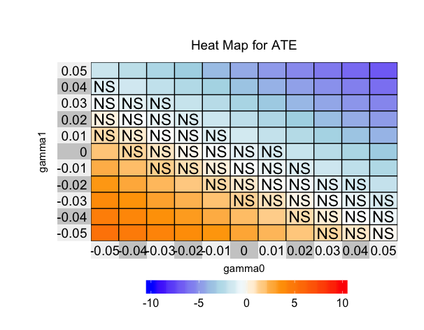
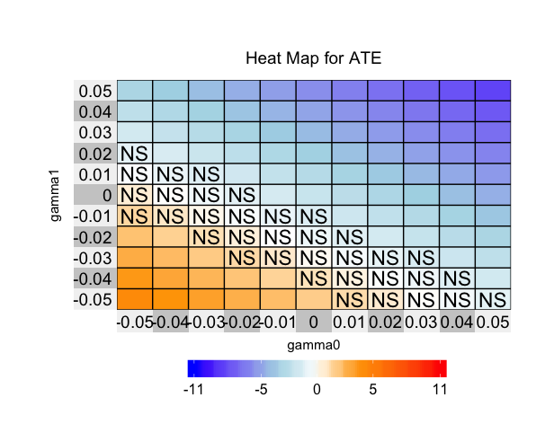
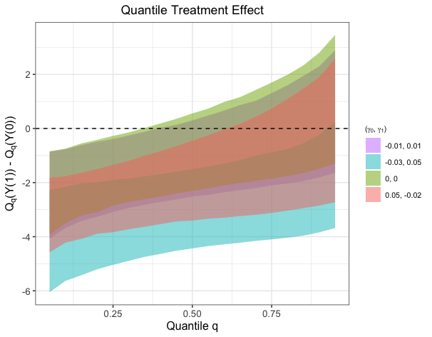

<!-- README.md is generated from README.Rmd. Please edit that file -->

```{r, echo = FALSE, message = F, warning = F}
knitr::opts_chunk$set(
  collapse = TRUE,
  comment = "#>",
  fig.path = "man/figures/figures-"
)
library(TukeySens)
```

# TukeySens
This package realizes the sensitivity analysis method based on Tukey's factorization, which allows flexible models for observed data and clean separation of the identified and unidentified parts of the sensitivity model. For theoretical details, [please see the full paper](https://arxiv.org/abs/1809.00399).  Specifically, TukeySens provides graphical tools that investigators can use to refine their sensitivity analyses and visualize the results.

# How to install the package

To install the development version on GitHub make sure you have the package `devtools` installed.

```{r, eval=FALSE}
# install.packages("devtools") 
devtools::install_github("JiajingZ/TukeySens")
```

# Basic Usage 
```{r}
# load package
library(TukeySens)
```


## Calibration
```{r,}
# Observed Pre-treatment Variables 
x = NHANES %>% select(-one_of("trt_dbp", "ave_dbp"))
# Treatment 
trt = NHANES %>% select(trt_dbp)
# Outcomes 
y = NHANES %>% select(ave_dbp)
# Sensitivity Parameter Sequence 
gamma = seq(0.01, 0.1, by = 0.001)
# plot 
caliplot(x, trt, y, gamma)
```

Based on the above plot, we may want to limit the magnitude of sensitivity parameter $\gamma_t$ with respect to body mass index (bmi), one of the most important predictors in terms of partial variance explained. Hence, we set $|\gamma_t| \ \leq \ 0.05$ for the following analysis.

## Result Visualization
### ATE by Heatmap
```{r, message = F, warning = F, eval = F}
# Observed data in treatment group
NHANES_trt <- NHANES %>% dplyr::filter(trt_dbp == 1)
x_trt <- NHANES_trt %>% select(-one_of("trt_dbp", "ave_dbp"))
y_trt <- NHANES_trt %>% select(ave_dbp)

# Observed data in control group 
NHANES_ctrl <- NHANES %>% dplyr::filter(trt_dbp == 0)
x_ctrl <- NHANES_ctrl %>% select(-one_of("trt_dbp", "ave_dbp"))
y_ctrl <- NHANES_ctrl %>% select(ave_dbp)

# ATE Heatmap 
# fit outcome separately
heatmap_ate(x_trt, y_trt, x_ctrl, y_ctrl, largest_effect = 0.05)
```


```{r, eval = F}
# fit outcome jointly
heatmap_ate(x_trt, y_trt, x_ctrl, y_ctrl, largest_effect = 0.05, joint = TRUE)
```


## QTE by Ribbon Plot
```{r, warning = F, message = F, eval = F}
# Ribbon Plot of QTE
gamma_select = rbind(c(0, 0), c(-0.03, 0.05), c(0.05, -0.02), c(-0.01, 0.01))
ribbon_qte(x_trt, y_trt, x_ctrl, y_ctrl, gamma_select)
```


```{r, eval = F}
ribbon_qte(x_trt, y_trt, x_ctrl, y_ctrl, gamma_select, joint = TRUE)
```


In addition, the ATE can be visualized by contour plot and QTE can be visualized by heatmap plot.


