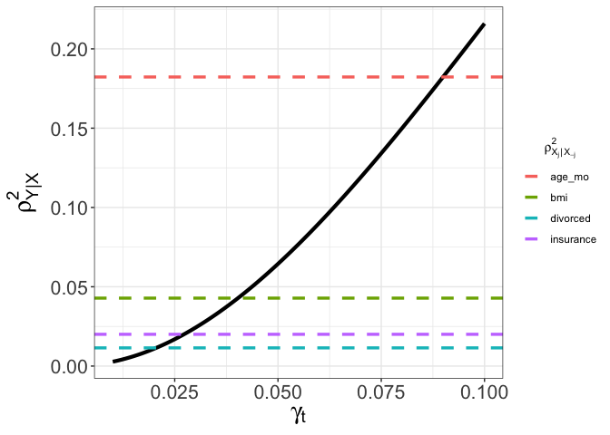
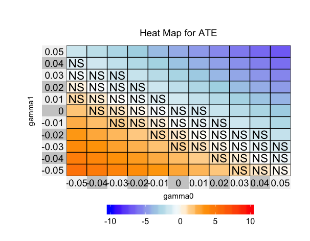
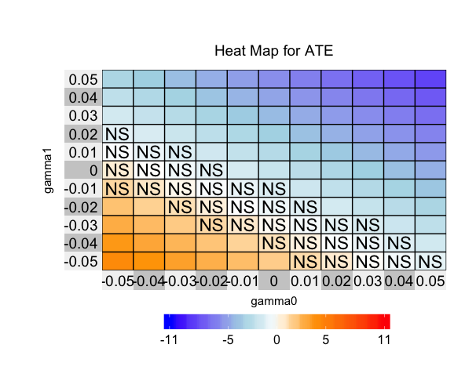
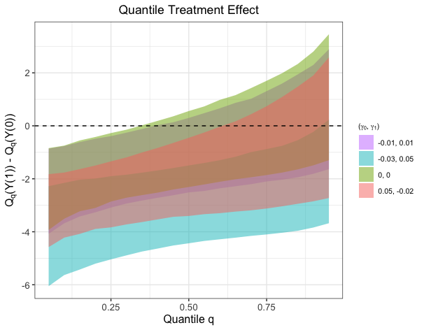
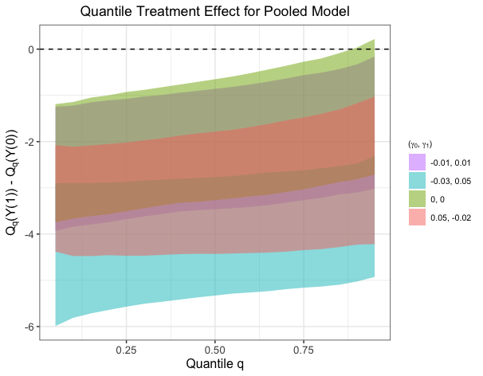

<!-- README.md is generated from README.Rmd. Please edit that file -->

# TukeySens

This package realizes the sensitivity analysis method based on Tukey’s
factorization, which allows flexible models for observed data and clean
separation of the identified and unidentified parts of the sensitivity
model. For theoretical details, [please see the full
paper](https://arxiv.org/abs/1809.00399). Specifically, TukeySens
provides graphical tools that investigators can use to refine their
sensitivity analyses and visualize the results.

# How to install the package

To install the development version on GitHub make sure you have the
package `devtools` installed.

``` r
# install.packages("devtools") 
devtools::install_github("JiajingZ/TukeySens")
```

# Basic Usage

``` r
# load package
library(TukeySens)
```

## Calibration

``` r
# Observed Pre-treatment Variables 
x = NHANES %>% select(-one_of("trt_dbp", "ave_dbp"))
# Treatment 
trt = NHANES %>% select(trt_dbp)
# Outcomes 
y = NHANES %>% select(ave_dbp)
# Sensitivity Parameter Sequence 
gamma = seq(0.01, 0.1, by = 0.001)
# plot 
caliplot(x, trt, y, gamma)
```

<!-- -->

Based on the above plot, we may want to limit the magnitude of
sensitivity parameter \(\gamma_t\) with respect to body mass index
(bmi), one of the most important predictors in terms of partial variance
explained. Hence, we set \(|\gamma_t| \ \leq \ 0.05\) for the following
analysis.

## Model fitting

Fit the BART outcome model. `largest_gamma` is the absolute magnitude of
the largest sensitivity parameter for Y(0) and Y(1). `joint` is a
logical which determines whether we infer Y(0) and Y(1) models
independently or together.

``` r
# Observed data in treatment group
NHANES_trt <- NHANES %>% dplyr::filter(trt_dbp == 1)
x_trt <- NHANES_trt %>% select(-one_of("trt_dbp", "ave_dbp"))
y_trt <- NHANES_trt %>% select(ave_dbp)

# Observed data in control group 
NHANES_ctrl <- NHANES %>% dplyr::filter(trt_dbp == 0)
x_ctrl <- NHANES_ctrl %>% select(-one_of("trt_dbp", "ave_dbp"))
y_ctrl <- NHANES_ctrl %>% select(ave_dbp)

tukey_out <- fit_outcome(x_trt, y_trt, x_ctrl, y_ctrl, largest_gamma = 0.05, joint=FALSE)
```

## Visualizing the results

We can plot a heatmap of the resulting model fit using the standard plot
function with `type="ate"`. Alternatively, we can visualize ribbon plots
of the quantile treatment effects with `type="ate"`. Note that in the
current implementation QTE visualization can be slow for large datasets,
since we are computing quantiles of n-component normal mixtures.

### ATE by Heatmap

``` r


# ATE Heatmap 
# fit outcome separately


plot(tukey_out, type="ate")

plot(tukey_out, type="qte")
```



``` r
# fit outcome jointly
heatmap_ate(x_trt, y_trt, x_ctrl, y_ctrl, largest_effect = 0.05, joint = TRUE)
```



## QTE by Ribbon Plot

``` r
# Ribbon Plot of QTE
gamma_select = rbind(c(0, 0), c(-0.03, 0.05), c(0.05, -0.02), c(-0.01, 0.01))
ribbon_qte(x_trt, y_trt, x_ctrl, y_ctrl, gamma_select)
```



``` r
ribbon_qte(x_trt, y_trt, x_ctrl, y_ctrl, gamma_select, joint = TRUE)
```



In addition, the ATE can be visualized by contour plot and QTE can be
visualized by heatmap plot.
